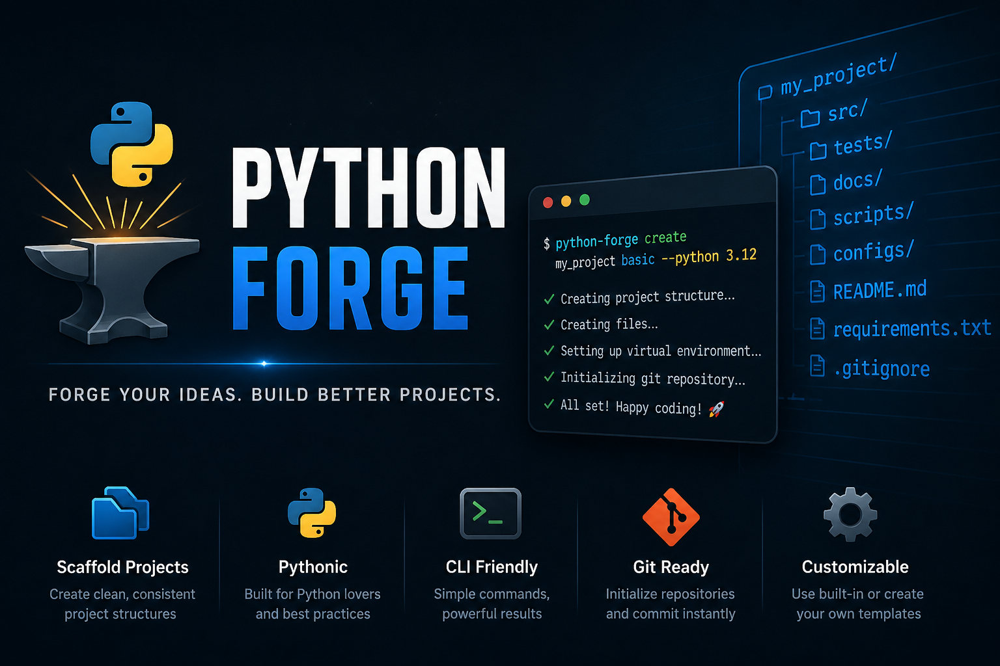

<p align="center">
  
</p>

<br>

# Python Forge


> Forge your ideas. Build better Python projects.

CLI tool to scaffold Python projects quickly, consistently, and professionally.

## Installation

Clone the repository:
```bash
git clone https://github.com/Minoiu-Mihai/python-forge.git
cd python-forge
pip install -r requirements.txt
```

## Requirements

- Python 3.10+
- pyyaml
- Git (optional, for repository initialization)

## Quick Start

```bash
python forge.py create my_project basic --python 3.12
```
This will:
- Create project structure
- Generate files
- Setup virtual environment
- Initialize Git repository


## Features

- Project scaffolding from templates
- Custom and built-in templates
- Automatic virtual environment creation
- Git initialization with first commit
- Smart incremental updates (no overwrite)
- CLI-first workflow

## Templates

### Built-in
- `basic` → minimal project
- `package` → installable Python package
- `cli` → CLI application
- `computer_vision` → CV/ML projects

### Custom
You can provide your own YAML template:

```bash
python forge.py create my_project path/to/template.yaml
```


## Usage

```bash
python forge.py create <project_name> <template> [options]
```
## Options
- `--python VERSION` → select Python version
- `--no-venv` → skip virtual environment
- `--no-git` → skip git init
- `--force` → apply template without confirmation


## Example Output

```bash
INFO | Creating project: my_project.
INFO | Creating folders...
INFO | Creating files...
INFO | Creating virtual environment...
INFO | Initializing git repository...

========== SUMMARY ==========
Project: my_project
Venv: created (Python 3.12)
Git: initialized
```

## Philosophy

Python Forge is designed to be:
- Simple
- Fast
- CLI-first

Not a heavy framework — just a clean, focused scaffolding tool.

## Roadmap

### v0.2 (next)
- [ ] `--version` flag
- [ ] Dry-run mode
- [ ] Template validation

### Future
- [ ] pip install packaging
- [ ] Remote templates (GitHub)
- [ ] Internal modularization

## Contributing

- Feel free to open issues or submit PRs.
- This project is evolving and feedback is welcome.

## License
MIT
